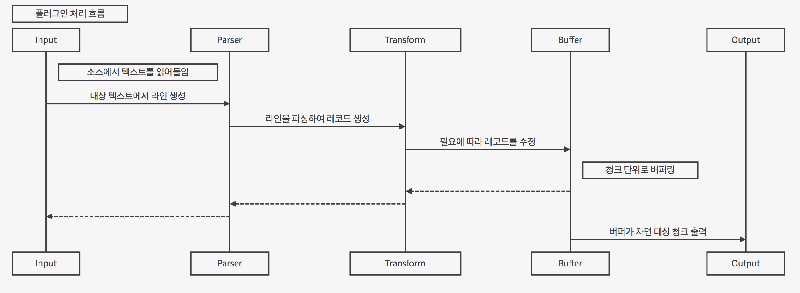

******************
Swak 플러그인 개발
******************

여기에서는 Swak 플러그인 개발에 대해 설명한다.

플러그인 분류
=============

플러그인은 크게 입력, 파서, 변경, 버퍼, 출력 그리고 명령 플러그인의 여섯가지 타입으로 나뉜다. 각 타입별 플러그인은 다음과 같은 패키지명 형식으로 시작한다.

- 입력 플러그인: ``in.``
- 파서 플러그인: ``par.``
- 변경 플러그인: ``mod.``
- 버퍼 플러그인: ``buf.``
- 출력 플러그인: ``out.``
- 명령 플러그인: ``cmd.``

이후의 플러그인의 이름은 클래스 이름 형식을 따른다.

입/출력 플러그인 처리 흐름
--------------------------

일반적으로 플러그인은 종류별로 다음과 같은 역할을 순서대로 수행한다.

- 입력: 데이터 소스에서 텍스트를 읽거나 생성하여 라인으로 변환
- 파서: 라인을 파싱하여 key-value 형태의 레코드로 변환 (선택적)
- 변경: 라인을 필터링 하거나, 레코드의 특정 필드를 추가, 삭제, 변경 (선택적)
- 버퍼: 레코드를 일정한 크기 또는 시간을 청크로하여 버퍼링 (선택적)
- 출력: 개별 레코드 또는 버퍼링된 청크를 출력 대상에 쓴다.

이외에 명령 플러그인은 테스크의 단계별로 다양한 일을 한다. 다음은 플러그인의 처리 흐름을 그려본 것이다.

플러그인의 처리 단계 별로 다음 사항을 주의하자:

- 임의의 날(Raw) 텍스트를 읽고 반환하는 ``in.tail`` 같은 입력 플러그인 뒤에는, 반드시 파서가 와야 한다.
- 알려진 형식의 텍스트를 읽어들이는 ``in.syslog`` 같은 입력 플러그인은, 자체적으로 파싱하여 레코드를 반환해야한다. 당연히 뒤에 파서가 올 필요가 없다.
- 파서 이후의 데이터는 모두 레코드 형식이다.
- 변경 플러그인(Modifier)는 파싱된 레코드를 처리한다.

.. note:: 입력과 출력 플러그인은 각각 시작과 끝에 처리되지만, 나머지 종류의 플러그인 들은 꼭 이 순서대로 처리되는 것은 아니다. 새로운 태그 지정을 통해 다양한 순서로 처리될 수 있다.

플러그인 파일 구성
==================

플러그인 파일은 다음과 같은 규칙으로 구성된다:

- 모든 디렉토리와 파일 명은 소문자, 숫자 그리고 ``_`` (즉, Snake Case 형식)로 기술한다.
- 디렉토리 안에는 ``__init__.py`` 파일이 있어야 한다. (파일 내용은 없음)
- 디렉토리 안에는 플러그인 타입에 맞는 접두어 + ``_`` + 이름 + ``.py`` 형식의 파이썬 모듈을 구현하여야 한다.
- 플러그인의 테스트는 ``test_`` + 플러그인 이름 + ``.py`` 형식으로 한다.
- 플로그인 도큐먼트는 ``README.md`` 에 기술한다. 문서 작성 방법은 `플러그인 문서화 규칙`_ 을 참고하자.

예를 들어 증가하는 숫자를 생성하는 입력 플러그인 ``Counter`` 를 만든다면, 다음과 같이 구성된다.::

    counter/
        __init__.py
        in_counter.py
        test_counter.py
        README.md

여기에서 ``in_counter.py`` 가 플러그인을 구현할 파이썬 모듈이다.

플러그인 모듈 구성
------------------

플러그인 모듈에는 플러그인 클래스와 그것의 인스턴스를 초기화해주는 코드가 필요하다.

플러그인 클래스
^^^^^^^^^^^^^^^

먼저 클래스 코드를 작성한다. 플러그인의 타입에 맞는 기본 클래스를 상속 받아 다음처럼 만들어 준다. (여기서는 입력 플러그인을 만들기에 ``BaseInput`` 을 상속 받는다.)

.. code-block:: python

    class Counter(BaseInput):
        pass

플러그인 타입별로 상속 받아야할 기본 클래스와, 구현해야할 메소드들이 있다. 이에 대해서는 이어서 소개하겠다.

플러그인 인스턴스 초기화
^^^^^^^^^^^^^^^^^^^^^^^^

각 플러그인의 인스턴스를 만들기 위해서는 그것에 맞는 다양한 설정값들이 필요하다. 이를 위해서 Click을 사용해 ``main`` 이라는 이름의 함수를 구현해야 한다.

.. note:: `Click <http://click.pocoo.org/5/>`_ 은 원래 파이썬에서 커맨드라인 인터페이스를 만들기 위한 툴이다. Swak에서는 **개별 플러그인을 하나의 커맨드라인 명령어처럼 취급** 하도록 고안 되었기에, Click을 이용해 플러그인 설정값을 받는다.

위에서 정의한 플러그인 인스턴스를 초기화 하는 함수 ``main`` 을 아래와 같이 작성한다.

.. code-block:: python

    @click.command(help="Generate incremental numbers.")
    @click.option('--max', default=10, show_default=True, help="Maximum count to"
                  " emit.")
    @click.option('--field', default=1, show_default=True, help="Number of count"
                  " fields.")
    @click.option('--delay', default=1, show_default=True, help="Delay seconds"
                  " before next count.")
    @click.pass_context
    def main(ctx, max, field, delay):
        return Counter(max, field, delay)

    if __name__ == '__main__':
        main()

Click의 사용법에 대해서는 Click의 문서를 참고하자.

.. note:: 국제적인 활용을 위해 코드내 주석문과 커맨드라인 도움말은 가급적 **영어** 로 기술하자.

플러그인 기본 클래스
====================

플러그인의 타입별 기본 클래스를 살펴보자.

.. note:: 명시적으로 **필수 구현** 을 표시하지 않은 클래스 메소드들은 모두 필요에 맞게 선택적으로 구현하면 된다. 부모 클래스에서 필수 구현 멤버 함수는 자식 클래스에서도 필수 구현이다.

실재 플러그인 구현은 타입별 부모 클래스들을 상속받아 구현한다. 타입별 기본 클래스를 살펴보자.

BasePlugin 클래스
-----------------

모든 타입 기본 클래스는 이 클래스를 상속받는다.

.. code-block:: python

    class Plugin(Object):

        def start(self):
            ...

        def stop(self):
            ...

        def shutdown(self):
            ...

다음과 같은 메소드를 갖고 있다.

start
^^^^^

이 메소드는 설정을 처리한 후, 테스크가 시작할 때 호출된다.

플러그인에서 사용할 파일, 스레드 등 리소스 생성을 여기에서 생성한다.

stop
^^^^

이 메소드는 테스크가 종료를 준비할 때 호출된다.

스레드 정지 플래그의 설정 등 실패하지 않는 간단한 일을 해야한다.

shutdown
^^^^^^^^

이 메소드는 테스크가 완전 종료되는 시점에서 호출된다.

``start`` 에서 만들어 두었던 파일, 스레드등 리소스를 여기에서 닫거나 제거한다.

BaseInput 클래스
----------------

이것을 상속받아 입력 플러그인 클래스를 만든다.

.. code-block:: python

    class BaseInput(BasePlugin):

        def read(self):
            ...

        def filter(self, text):
            ...

        def parser(self, line):
            ...

다음과 같은 메소드를 갖고 있다.

read (필수 구현)
^^^^^^^^^^^^^^^^

다음과 같은 형식으로 구현한다.

1. 소스에서 라인으로 구분되는 텍스트를 읽어온다.
2. 만일 명시된 ``encoding`` 이 있다면 그것을 이용하여 ``utf8`` 텍스트로 변환한다.
3. 텍스트를 라인 단위로 구분하고,
4. ``filter`` 를 통과한 라인들만
5. 반환(``yield``)한다. 이때 ``syslog`` 처럼 알려진 형식의 데이터를 위한 입력 플러그인이라면, 자체적으로 파싱하여 레코드를 반환하고, 그렇지 않으면 그냥 라인을 반환한다.

filter
^^^^^^

레코드로 파싱될 필요가 없는 라인을 거르는 역할. 읽어온 라인들 중 대상이 되는 라인에 대해 ``True``, 아니면 ``False`` 를 반환한다. 기본은 모든 라인에 대해 ``True``.

BaseParser 클래스
-----------------

이것을 상속받아 파서 클래스를 만든다.

.. code-block:: python

    class BaseParser(BasePlugin):

        def parse(self, text):
            ...

다음과 같은 메소드를 갖고 있다.

parse (필수 구현)
^^^^^^^^^^^^^^^^^

Input에서 넘어온 텍스트의 파싱하여 레코드를 반환

BaseModifier 클래스
-------------------

이것을 상속받아 변경 클래스를 만든다.

.. code-block:: python

    class BaseModifier(BasePlugin):

        def modify(self, records):
            ....

``configure`` 함수에서 받은 레코드에 대해 템플릿을

다음과 같은 메소드를 갖고 있다.

modify (필수 구현)
^^^^^^^^^^^^^^^^^^

``configure`` 에서 받은 레코드들에 대해 템플릿을 확장한 후, 인자로 받은 레코드에 변경을 가한 새 레코드를 반환한다.

BaseBuffer 클래스
-----------------

이 것을 상속받아 버퍼 클래스를 만든다.

.. code-block:: python

    class BaseBuffer(BasePlugin):

        def append(self, record):
            ...

다음과 같은 메소드를 갖고 있다.

append (필수 구현)
^^^^^^^^^^^^^^^^^^

건내진 레코드를 버퍼에 추가. flush 할 조건이 되면 청크를 구성하여 반환.

BaseOutput 클래스
-----------------

이것을 상속받아 출력 클래스를 만든다.

.. code-block:: python

    class BaseOutput(Plugin):

        def write_stream(self, tag, es):
            ...

        def write_chunk(self, chunk):
            ...

다음과 같은 메소드를 갖고 있다.

write_stream (필수 구현)
^^^^^^^^^^^^^^^^^^^^^^^^

건네진 이벤트 스트림을 출력. (앞에 버퍼가 없는 경우)

write_chunk (필수 구현)
^^^^^^^^^^^^^^^^^^^^^^^

건네진 청크를 출력.(앞에 버퍼가 있는 경우)

BaseCommand 클래스
------------------

이것을 상속받아 명령 클래스를 만든다.

.. code-block:: python

    class BaseCommand(Plugin):

        def execute(self)

다음과 같은 메소드를 갖고 있다.

execute (필수 구현)
^^^^^^^^^^^^^^^^^^^

명령이 수행할 코드.

파이썬 버전
===========

Swak는 파이썬 2.7와 3.5를 지원한다.

.. note:: 2.7을 지원하는 이유는 일부 OS의존 적인 외부 패키지의 활용을 위해서이고, 3.5를 지원하는 이유는 현재 PyInstaller가 지원하는 가장 높은 버전이기 때문이다.

플러그인 개발자는 다음을 기억하자.

- 가급적 파이썬 2.7와 3.5 양쪽에서 돌아가도록 개발하자. (tox를 활용!)
- 2.7만 지원하는 경우는, 2.7에서만 지원되는 외부 패키지를 사용하기 위해서로 한정
- 2.7만 지원하는 하나의 플러그인을 사용하려면, 사용자는 Swak을 파이썬 2.7로 빌드해야 한다.
- 이는 다른 모든 플러그인도 2.7 기반으로 동작하게 된다는 뜻

기타 규칙
=========

플러그인 저장소 규칙
--------------------

여기서 Swak의 플러그인 코드는 GitHub을 통해서 관리되는 것으로 가정하며, 다음과 같은 규칙을 따라야 한다.

- GitHub의 저장소(Repository) 이름은 ``swak-`` 으로 시작한다.
- 정해진 규칙에 맞게 문서화 되어야 한다.
- 버전 정보를 갖는다.
- 플러그인이 의존하는 패키지가 있는 경우 ``requirements.txt`` 파일을 만들고 명시한다. (의존 패키지가 없다면 만들지 않는다.)

플러그인 문서화 규칙
--------------------

각 플러그인은 ``README.md`` 파일에 문서화를 해야한다. GitHub의 `마크다운 형식  <https://guides.github.com/features/mastering-markdown/>`_ 에 맞게 다음과 같이 작성한다.

- 처음에 H1(``#``)으로 ``swak-NAME`` 형식으로 플러그인의 이름 헤더가 온다.
    - 본문으로 플러그인에 대한 간단한 설명을 한다.
- 그 아래 H2(``##``)로 ``설정 예시`` 헤더가 온다.
    - 본문으로 설정 파일의 간단한 예를 보여준다.
- 그 아래 H2(``##``)로 ``동작 방식`` 헤더가 온다.
    - 본문으로 플러그인의 내부 동작에 관한 설명을 한다.
- 그 아래 H2(``##``)로 ``인자들`` 헤더가 온다.
    - 그 아래 각 인자에 대해 H3(``###``) 헤더가 온다.
        - 본문으로 인자에 대해 설명한다.

즉, 아래와 같은 구조를 같는다.

.. code-block:: markdown

    # swak-NAME

    ## 설정 예시

    ## 동작 방식

    ## 인자들

플러그인 버전 규칙
------------------

`유의적 버전 문서  <http://semver.org/lang/ko/>`_ 를 참고하여 플러그인 버전을 명시한다.

.. topic:: 요약

    - 버전을 주.부.수 숫자로 한다.
    - 기존 버전과 호환되지 않게 API가 바뀌면 “주(主) 버전”을 올림.
    - 기존 버전과 호환되면서 새로운 기능을 추가할 때는 “부(部) 버전”을 올림.
    - 기존 버전과 호환되면서 버그를 수정한 것이라면 “수(修) 버전”을 올린다.

환경 버전 규칙
--------------

플러그인은 파이썬 및 Swak 환경 아래에서 동작한다. 따라서 플러그인 개발자가 지원하는 파이썬 및 Swak 버전을 명기해야 한다.

샘플 플러그인
=============

각 행마다 행번호를 붙여주는 간단한 출력용 플러그인 ``linenumber`` 을 예제로 알아보자.

1. 먼저 GitHub에서 ``swak-linenumber`` 라는 빈 저장소를 만든다. (이때 원하는 라이센스를 선택하고 ``README.md`` 생성을 체크한다.)
2. Swak의 ``plugins`` 디렉토리로 이동한다.
3. 저장소를 ``clone`` 한다.::

    git clone https://github.com/GitHub계정/swak-linenumber.git

4. ``main.py`` 파일을 만들고 플러그인 코드를 작성한다.
5. 테스트용 설정 파일 ``cfg-test.yml`` 을 작성한다.
6. Swak의 기본 디렉토리로 돌아와 ``python swak.runner swak/plugins/linenumber/cfg-test.yml`` 로 실행해본다.
