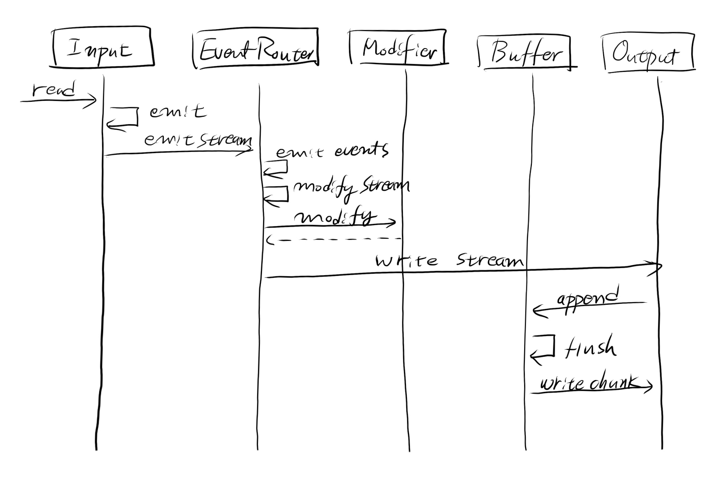
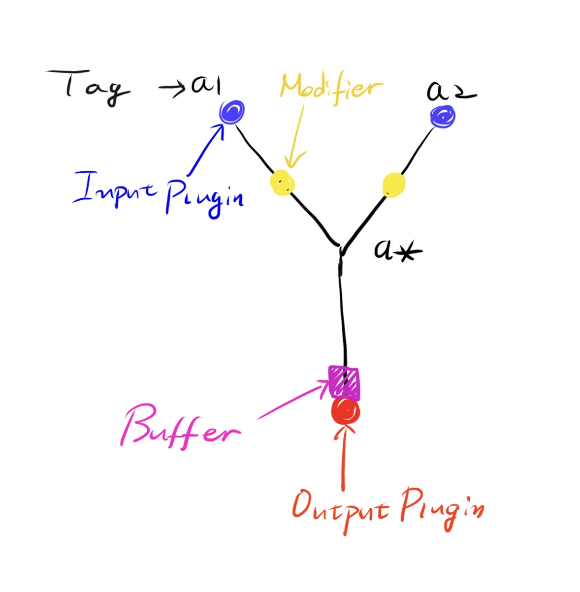
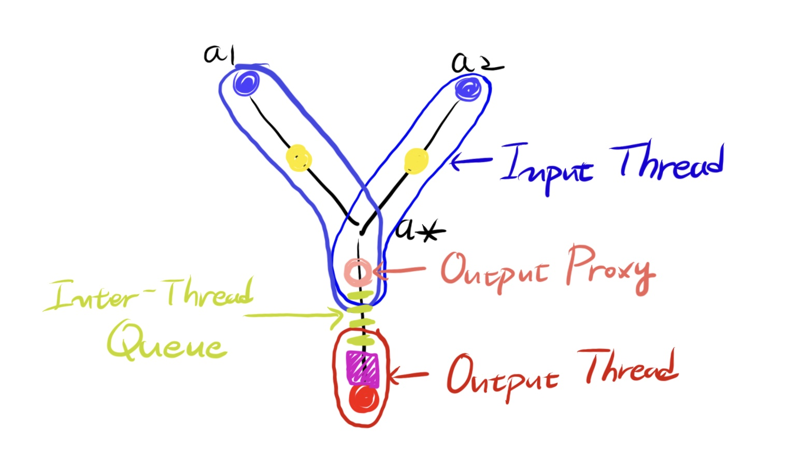
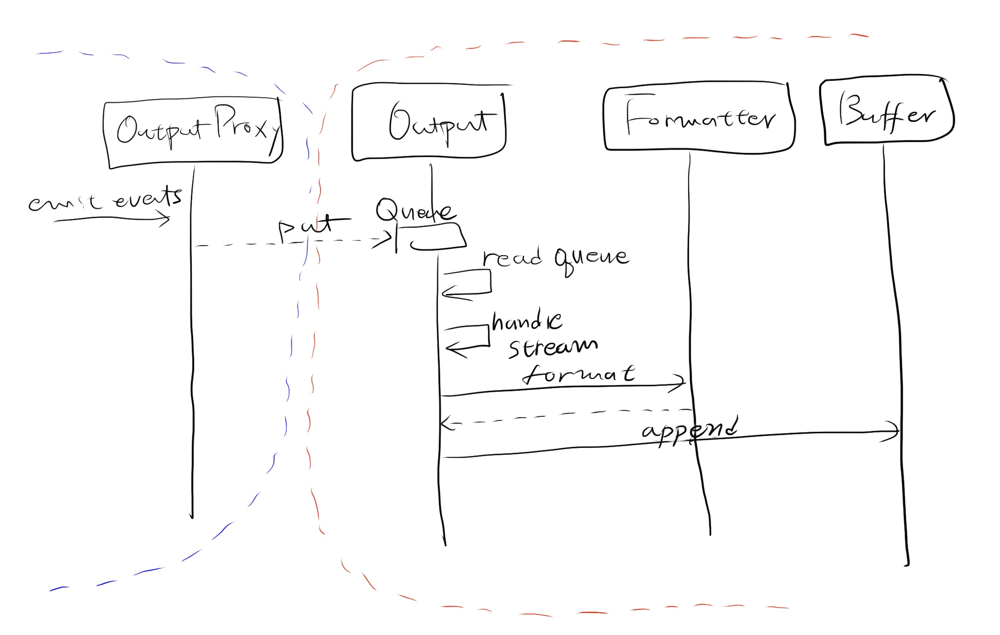

*************
플러그인 개발
*************

여기에서는 Swak 플러그인 개발에 대해 설명한다.

.. important:: 플러그인은 표준(Standard) 플러그인과 외부(External) 플러그인으로 나눌 수 있다. 각각 Swak 소스 디렉토리의 ``stdplugins/`` 과 ``plugins/`` 디렉토리에 위치한다. Swak 코드와 함께 배포되는가의 차이일 뿐, 구조적으로는 동일하다.

플러그인 규칙
=============

플러그인은 **접두사** 와 **이름** 을 갖는다.

플러그인 접두사
---------------

플러그인은 크게 입력, 파서, 변경, 버퍼, 출력 그리고 명령 플러그인의 다섯가지 타입으로 나뉜다. 각 타입별 플러그인은 다음과 같은 접두사를 갖는다.

- 입력 플러그인: ``in.``
- 파서 플러그인: ``par.``
- 변경 플러그인: ``mod.``
- 출력 플러그인: ``out.``

플러그인 이름
-------------

플러그인 모듈의 파일명은 다음과 같은 규칙을 따른다.

* 영소문자, 숫자 그리고 ``_`` 만 사용해서 기술한다.
* 첫 시작은 영소문자

이 모듈안에 플러그인 클래스를 구현한다. 클래스 이름은 일반적인 파이썬 관례를 따른다.

풀네임의 이용
-------------

플러그인 접두사와 이름을 '접두사.이름' 형식으로 함께 스는 것을 **풀네임(Fullname)** 으로 칭한다. Swak 커맨드 라인 명령에서 플러그인은 풀네임으로 사용한다.

플러그인 처리 흐름
------------------

일반적으로 플러그인은 종류별로 다음과 같은 역할을 순서대로 수행한다.

- 입력: 데이터 소스에서 텍스트를 읽어서 라인을 반환하거나, 데이터를 생성하여 레코드를 변환
- 파서: 라인을 파싱하여 key-value 형태의 레코드로 변환 (선택적)
- 변경: 라인을 필터링 하거나, 레코드의 특정 필드를 추가, 삭제, 변경 (선택적)
- 버퍼: 레코드를 일정한 크기 또는 시간을 청크로하여 버퍼링 (선택적)
- 출력: 개별 레코드 또는 버퍼링된 청크를 출력 대상에 쓴다.

다음은 플러그인의 처리 흐름을 그려본 것이다.

플러그인의 처리 단계 별로 다음 사항을 주의하자:

- 임의의 날(raw) 텍스트를 읽어 라인을 반환하는 ``in.tail`` 같은 입력 플러그인 뒤에는, 반드시 파서 플러그인이 와야 한다.
- 알려진 형식의 텍스트를 읽어들이는 ``in.syslog`` 같은 입력 플러그인은, 자체적으로 파싱하여 레코드를 반환해야한다. 당연히 뒤에 파서가 올 필요가 없다.
- 파서 이후의 데이터는 모두 레코드 형식이다.
- 변경 플러그인(Modifier)은 파싱된 레코드에 변경을 가한다.

.. tip:: 입력과 출력 플러그인은 각각 시작과 끝에 처리되지만, 나머지 종류의 플러그인 들은 꼭 이 순서대로 처리되는 것은 아니다. 새로운 태그 지정을 통해 다양한 순서로 처리될 수 있다.

플러그인의 인자 검증
--------------------

플러그인 객체가 생성될 때 잘못된 인자 또는 논리적인 오류를 일으키는 인자가 나올 수 있다. 이런 경우 플러그인의 생성자에서 확인을 하고 문제가 있는 경우 예외를 발생시키도록 한다.

.. note:: Stackoverflow의 `관련 아티클 <http://https://stackoverflow.com/questions/8919952/python-practices-is-there-a-better-way-to-check-constructor-parameters>`_ 을 참고하자.

.. _stackoverflow: http://

플러그인의 리소스 관리
----------------------

플러그인은 파일, DB커서, 자체 스레드 등 다양한 리소스를 사용할 수 있다. Swak 플러그인은 다음과 같은 규칙을 지켜야 한다.

- 플러그인 객체의 생성자에서는 초기화에 필요한 인자만 설정한다.
- 리소스 할당은 ``start`` 함수에서 한다.
- 리소스 해제는 ``shutdown`` 함수에서 한다. (객체 종료시에 자동으로 해제되는 리소스에 대해서는 명시적으로 할 필요가 없다.)

.. important:: 생성자에서 리소스를 할당하게 되면, 스레드를 생성할 때 플러그인 복사 과정에서 필요없는 리소스 할당이 일어나게 된다. 자세한 것은 `플러그인과 스레드`_ 를 참고하자.

플러그인 설정 관련 접미사
-------------------------

시간 접미사
^^^^^^^^^^^

+--------+------+----------------+
| 접미사 | 의미 | 예시           |
+========+======+================+
| ``s``  | 초   | ``10s`` (10초) |
+--------+------+----------------+
| ``m``  | 분   | ``5m`` (5분)   |
+--------+------+----------------+
| ``h``  | 시간 | ``3h`` (3시간) |
+--------+------+----------------+
| ``d``  | 일   | ``2d`` (2일)   |
+--------+------+----------------+

용량 접미사
^^^^^^^^^^^

+--------+------+-------------------+
| 접미사 | 의미 | 예시              |
+========+======+===================+
| ``k``  | KB   | ``64k`` (64 KB)   |
+--------+------+-------------------+
| ``m``  | MB   | ``512m`` (512 MB) |
+--------+------+-------------------+
| ``g``  | GB   | ``1g`` (1 GB)     |
+--------+------+-------------------+
| ``t``  | TB   | ``2t`` (2 TB)     |
+--------+------+-------------------+

포매터와 버퍼
=============

포매터(Formatter)와 버퍼(Buffer)는 객체는 플러그인은 아니지만, 모든 출력 플러그인은 필수적으로 포매터를, 선택적으로 버퍼를 갖기에 여기에서 함께 설명하겠다.

포매터
------

포매터는 태그, 시간, 레코드를 주어진 형식으로 변환하는 역할을 한다.

다음과 같은 포매터 클래스가 있다.

``StdoutFormatter``
  ``out.stdout`` 플러그인에서 사용하는 형식으로, tag datetime record 형식으로 출력된다.

``DsvFormatter``
  Delimiter Seperated Values의 약자로, CSV나 TSV 형식으로 출력할 때 사용한다.

``JsonFormatter``
  JSON 형식으로 출력할 때 사용한다.

``MessagePackFormatter``
  `MessagePack <http://msgpack.org>`_ 형식으로 ``out.fluentd`` 플러그인에서 사용된다.

모든 포매터 플러그인은 다음과 같은 공통 기능을 갖는다.

포매터를 통한 타임존 설정
^^^^^^^^^^^^^^^^^^^^^^^^^

Swak 내부에서 모든 메시지 시간은 Unix Timestamp 형식으로 사용되다가, 출력 직전에 포매터 플러그인을 통해서 DateTime 형식으로 변환된다. 이때 타임존을 지정할 수 있다. 기본값은 ``UTC`` 이다. 타임존 설정은 모든 종류의 포매터가 지원한다.

.. note:: 시간을 다루는 좋은 방법은 항상 UTC로 시간을 다루고, 사람이 보기 위해 출력할 때만 해당 지역 시간으로 변환해 보여주는 것이다.

버퍼
----

버퍼 플러그인은 하나 이상의 입력에서 이벤트를 받아 모으고, 적절한 조건이 되면 **청크(chunk)** 단위로 **플러쉬(flush, 내려보냄)** 하여 출력 플러그인에 전달하는 역할을 한다.

버퍼 플러그인은 **출력 풀러그인** 에 내장되어 사용된다

버퍼 포맷 옵션
^^^^^^^^^^^^^^

청크에서 데이터를 어떻게 저장할 지에 대한 옵션.

- ``binary`` - 데이터를 바이너리 형식으로 인코딩해서 저장할 지 여부. 기본은 ``True`` 이다.

버퍼는 저장 타입별로 **메모리 버퍼** 와 **디스크 버퍼** 로분류할 수 있다.

메모리 버퍼
^^^^^^^^^^^

메모리 버퍼는 지나치게 잦은 IO 출력을 방지하여 성능을 높여주는 역할을 한다. 크게 **크기 조각(Size Slice)** 과 **시간 조각(Time Slice)** 으로 플러쉬 될수 있다.

.. note:: 메모리 버퍼는 Swak 에이전트가 비정상 종료시 출력되지 않은 데이터를 유실한다.

디스크 버퍼
^^^^^^^^^^^

메모리 버퍼와 마찬가지로 지나치게 잦은 IO 출력을 방지하여 성능을 높여주며, 추가적으로 Swak 에이전트가 비정상적으로 종료하거나 원격 서버가 정상적으로 작동하지 않는 경우 디스크에 데이터를 저장해두고 정상화 되었을 때 재개하여 데이터 손실을 막아준다.

버퍼의 청크
^^^^^^^^^^^

모든 버퍼 플러그인은 내부적으로 하나 이상의 청크를 갖는다. 청크는 버퍼 내부의 구조체로 실제 데이터를 저장하는 단위이다. 청크는 다음과 같은 역할을 한다.

- 시간 조각 등 데이터를 키로 나누어서 저장해야할 때 저장의 단위.
- 디스크 버퍼에서 디스크에 저장하는 단위.
- 디스크에 저장 후 출력이 되지 못한 청크는 Swak 재기동시 재개 되어 정상 출력될 수 있다.

버퍼는 청크를 어떤 단위로 생성할 지에 따라 **크기 조각** 형과 **시간 조각** 형으로 나눌 수 있다.

크기 조각
^^^^^^^^^

현재 청크가 일정 크기 이상이 되면, 새로운 청크를 만들고 가장 오래된 청크는 플러쉬 한다.

.. note:: 시간 관련 옵션은 `시간 접미사`_ 를 참고하고, 용량 관련 옵션은 `용량 접미사`_ 를 참고하자.

특정 조건을 만족하면 새로운 청크를 만들고 가장 오래된 청크는 플러쉬한다. 청크 포맷에 관계없이 새로운 청크를 만드는 조건 옵션은 아래와 같다.

- ``chunk_max_record`` - 청크의 레코드 수가 이것보다 커지는 경우.
- ``flush_interval`` - 플러쉬할 시간 간격이 되면. (기본 ``10s``)
- ``buffer_max_chunk`` - 버퍼의 청크 수가 이것보다 커지면. (기본 64개)

만약 ``binary`` 옵션이 ``True`` 이면 아래의 옵션을 추가적으로 사용할 수 있다.

- ``chunk_max_size`` - 청크가 이 크기 이상이되면. (기본 ``8m``)
- ``buffer_max_size`` - 전체 버퍼의 크기가 일정 이상되면. (기본 ``512m``)

시간 조각
^^^^^^^^^
- ``time_slice_format`` - 이 시간 포맷 단위로 청크를 나눈다.
- ``time_slice_wait`` - 시간 조각을 시행하기 전 기다리는 시간. 조금 늦게 들어오는 메시지를 위해 필요하다. (기본 ``5m``)

플러쉬와 새로운 청크의 생성
^^^^^^^^^^^^^^^^^^^^^^^^^^^

현재 청크가 정해진 크기(``chunk_max_size`` 또는 ``buffer_max_size``) 또는 정해진 갯수(``chunk_max_record``, ``buffer_max_chunk``) 또는 정해진 시간(``flush_interval``)을 넘으면 새로운 청크가 생성되고, 가장 오래된 청크가 플러쉬 된다.

.. note:: ``flush_interval`` 과 ``time_slice_wait`` 은 상호 배제적인 옵션이다.

포매터, 버퍼, 그리고 청크 통한 출력 과정
^^^^^^^^^^^^^^^^^^^^^^^^^^^^^^^^^^^^^^^^

.. image:: _static/format_buffer_chunk.jpg
  :width: 600

플러그인과 스레드
=================

Swak은 CPU의 멀티 코어를 효율적으로 이용하기 위해, 플러그인을 위한 별도 스레드를 생성한다.

.. note:: Swak CLI의 테스트 커맨드 모드에서는 디버깅의 용이성을 위해 메인 스레드에서 동작한다.

스레드 종류
-----------

스레드 종류는 입력 플러그인을 위한 **입력 스레드** 와 출력 플러그인을 위한 **출력 스레드** 로 나뉜다.

입력 스레드
^^^^^^^^^^^

개별 입력 플러그인은 각자의 스레드를 가진다. 입력 스레드에는 다음과 같은 플러그인이 속한다.

.. code-block:: text

    입력 플러그인, 파싱 플러그인, 변경 플러그인

출력 스레드
^^^^^^^^^^^
출력 플러그인이 하나 이상의 입력 플러그인에서 생성된 이벤트를 받을 때 사용하는 스레드. 다음과 같은 플러그인이 속한다.

.. code-block:: text

    버퍼 플러그인, 출력 플러그인

스레드 모델
-----------

스레드 모델은 크게 인풋과 출력 플러그인이 같은 스레드에 있는 **개별 스레드 모델** 과, 인풋과 출력이 다른 스레드에 위치한 **결합 스레드 모델** 의 두가지 모델이 있다.

개별 스레드 모델
^^^^^^^^^^^^^^^^

개별 스레드 모델은 입력에서 출력 플러그인까지의 모든 플러그인이 같은 스레드 아래에서 수행되는 모델이다. 출력 플러그인이 하나의 입력 플러그인에서 생성되는 이벤트만 다룰 때 사용된다.

예를 들어 아래와 같은 설정파일이 있다면:

.. code-block:: yaml

    sources:
      - in.file -f file1 --tag file1  # 입력 스레드 1에서 실행
      - in.file -f file2 --tag file2  # 입력 스레드 2에서 실행

    matches:
      "file1":
        - out.file -f out1  # 입력 스레드 1에서 실행
      "file2":
        - out.file -f out2  # 입력 스레드 2에서 실행

``file1`` 과 ``file2`` 을 위해 모두 두 개의 스레드가 할당된다.

결합 스레드 모델
^^^^^^^^^^^^^^^^

여러 입력 플러그인에서 생성한 이벤트가 하나의 출력 플러그인으로 모여서 처리가 되는 경우이다. 이 경우 각 입력 플러그인과 출력 플러그인을 위해 하나씩 스레드가 생성된다.

예를 들어 아래와 같은 설정파일이 있다면:

.. code-block:: yaml

    sources:
      - in.file -f file1 --tag file  # 입력 스레드 1에서 실행
      - in.file -f file2 --tag file  # 입력 스레드 2에서 실행

    matches:
      "file":
        - out.file -f out  # 출력 스레드 3에서 실행

``file1`` 과 ``file2`` 의 입력을 위해 두 개, 그리고 ``file`` 에 결합된 출력을 위해 한 개, 모두 세 개의 스레드가 필요하다.

플러그인의 스레드 배정
^^^^^^^^^^^^^^^^^^^^^^

결합 스레드 모델에서 출력전에 수행할 플러그인이 있는 다음과 같은 경우:

.. code-block:: yaml

    sources:
      - in.file -f file1 --tag file  # 입력 스레드 1에서 실행
      - in.file -f file2 --tag file  # 입력 스레드 2에서 실행

    matches:
      "file":
        - par.myparser     # 입력 스레드 1, 2에서 각각 실행
        - out.file -f out  # 출력 스레드 3에서 실행

``file1`` 과 ``file2`` 의 파싱 과정이 필요한데, 그것은 각 입력 플러그인과 같은 스레드 아래에서 수행되고, 그 결과가 출력 스레드에 모여서 출력된다.

그러나, 출력 앞에 버퍼 플러그인이 있는 다음과 같은 경우:

.. code-block:: yaml

    sources:
      - in.file -f file1 --tag file  # 입력 스레드 1에서 실행
      - in.file -f file2 --tag file  # 입력 스레드 2에서 실행

    matches:
      "file":
        - par.myparser     # 입력 스레드 1, 2에서 각각 실행
        - buf.file         # 출력 스레드 3에서 실행
        - out.file -f out  # 출력 스레드 3에서 실행

버퍼 플러그인은 출력과 같은 스레드에서 실행된다.

스레드 생성 과정
----------------

플러그인을 위한 스레드는 아래와 같은 순서로 생성, 호출된다.

#. 이벤트 라우터와 개별 플러그인 생성.
#. 이벤트 라우터에 ``add_rule`` 로 플러그인 추가
#. 이벤트 라우터의 ``build_threads`` 메소드를 통해 스레드 객체 생성
#. 각 스레드 객체에 대해 ``run`` 호출

스레드 객체 생성
^^^^^^^^^^^^^^^^

스레드의 생성은 ``build_threads`` 메소드를 통해 다음과 같이 이루어진다.

#. 각 입력 플러그인을 위한 스레드(**입력 스레드**) 생성. 이때 이벤트 라우터를 복사(라우터의 플러그인들은 아직 리소스가 생성되지 않은 상태)
#. 하나 이상의 파이프라인에서 공유되는 출력 플러그인(**공유 출력 플러그인**)에 대한 스레드(**출력 스레드**) 생성. 출력 스레드는 (버퍼를 내부에 갖는)출력 플러그인 만을 가짐
#. 공유 출력 플러그인을 위한 큐를 만들고, 이 출력 플러그인에 연결되는 입력 스레드의 출력 플러그인에 설정(보내기 큐, 이 출력 플러그인은 이제 프락시로만 동작)하고, 공유 출력 플러그인의 버퍼에도 큐를 설정(받기 큐)
#. 각 스레드의 스레드의 ``start`` 를 호출하여 플러그인에서 필요한 리소스를 생성하게 함.

.. note:: 출력 플러그인은 하나의 입력 플러그인에 대해서만 사용되는 경우 입력 스레드에서 동작한다.

.. topic:: 출력 프락시

    입력 스레드와 출력 스레드가 분리되면 서로간 통신은 ``Queue`` 를 통해서 해야 한다. 출력 프락시는 다른 플러그인이 이런 내용을 알 필요가 없이 진짜 출력 플러그인 처럼 호출하게 해준다.

결합 스레드 모델에서 스레드 배정의 예
^^^^^^^^^^^^^^^^^^^^^^^^^^^^^^^^^^^^^

좀 더 자세히 이해하기 위해 다음과 같은 경우를 생각해보자.

- ``a1`` 과 ``a2`` 의 두 태그로 입력 플러그인이 있다.
- 각 입력의 다음 변경 플러그인이 붙어 있다.
- 두 태그의 이벤트는 ``a*`` 로 하나의 출력 플러그인에 결합되어 출력된다.
- 출력 플러그인에는 버퍼 플러그인이 붙어 있다.

``build_threads`` 를 수행하면 다음과 같은 일들이 일어난다.

- ``a1`` 과 ``a2`` 위한 입력 스레드와, ``a*`` 을 위한  출력 스레드가 생성.
- 스레드간 통신을 위한 ``Queue`` 가 생성.
- 각 스레드는 이벤트 라우터를 깊은 복사해 가짐.
- 이벤트 라우터의 출력 플러그인은 각각 두 개의 출력 프락시로 변경된다.
- 두 입력 스레드에서 발생한 이벤트는 출력 프락시에서 스레드간 큐를 통해 출력 스레드의 출력 버퍼로 전달된다.
- 출력 버퍼는 조건이 되었을 때 ``flush`` 하여 출력 플러그인으로 보낸다.

.. important:: 스레드가 생성될 때 이벤트 라우터에 있는 파이프라인에 있는 플러그인들을 **복사** 한다. 따라서 모든 플러그인들은 복사가 **가능** 해야 한다. 일반적인 파이썬 객체는 ``copy.copy`` 에 의해 복사가 가능하나, 만약 플러그인 내에서 직접 C/C++를 통해  메모리 할당을 하는 등의 경우라면 특별 메소드 ``__copy__`` 와 ``__deepcopy__`` 를 구현해 주어야 할 것이다.

결합 스레드 모델에서 에이전트의 동작 과정
-----------------------------------------

1. 등록된 스레드들 시작
2. 입력 스레드 동작

  #. 스레드 메인에서 입력 플러그인의 ``read`` 메소드 호출하고, 이를 통해 라우터의 ``emit_events`` 메소드 호출됨.
  #. 출력 프락시에서 큐에 넣음.

3. 출력 스레드 동작

  #. 스레드 메인에서 주기적으로 ``read_queue`` 하고, 얻어진 이벤트 스트림으로 ``handle_stream`` 호출
  #. ``handle_stream`` 에서 각 이벤트에 대해 포매터를 통해 ``format`` 을 수행하고, 그 결과를 버퍼에 ``append``
  #. 버퍼는 받은 이벤트로 청크의 ``concat`` 을 호출하고
  #. 청크는 조건이 되었을 때 ``flush``

플러그인 파일 구성
==================

플러그인 파일은 다음과 같은 규칙으로 구성된다:

- 모든 디렉토리와 파일 명은 소문자, 숫자 그리고 ``_`` (즉, Snake Case 형식)로 기술한다.
- 디렉토리 안에는 ``__init__.py`` 파일이 있어야 한다. (파일 내용은 없음)
- 디렉토리 안에는 플러그인 타입에 맞는 접두어 + ``_`` + 이름 + ``.py`` 형식의 파이썬 모듈을 구현하여야 한다.
- 플러그인의 테스트는 ``test_`` + 플러그인 이름 + ``.py`` 형식으로 한다.
- 플러그인 도큐먼트는 ``README.md`` 에 기술한다. 문서 작성 방법은 `플러그인 패키지 문서화 규칙`_ 을 참고하자.

예를 들어 증가하는 숫자를 생성하는 입력 플러그인 ``Counter`` 를 만든다면, 다음과 같이 구성된다.::

    counter/
        __init__.py
        in_counter.py
        test_counter.py
        README.md

여기에서 ``in_counter.py`` 가 플러그인을 구현할 파이썬 모듈이다.

플러그인 모듈 구성
------------------

플러그인 모듈에는 플러그인 클래스와 그것의 인스턴스를 초기화해주는 코드가 필요하다.

플러그인 클래스
^^^^^^^^^^^^^^^

먼저 클래스 코드를 작성한다. 플러그인의 타입에 맞는 기본 클래스를 상속 받아 다음처럼 만들어 준다. (여기서는 직접 데이터를 생성하는 입력 플러그인을 만들기에 ``RecordInput`` 을 상속 받는다.)

.. code-block:: python

    class Counter(RecordInput):
        pass

플러그인 타입별로 상속 받아야할 기본 클래스와, 구현해야할 메소드들이 있다. 이에 대해서는 이어서 소개하겠다.

플러그인 인스턴스 초기화
^^^^^^^^^^^^^^^^^^^^^^^^

각 플러그인의 인스턴스를 만들기 위해서는 그것에 맞는 다양한 설정값들이 필요하다. 이를 위해서 Click을 사용해 ``main`` 이라는 이름의 함수를 구현해야 한다.

.. note:: `Click <http://click.pocoo.org/5/>`_ 은 원래 파이썬에서 커맨드라인 인터페이스를 만들기 위한 툴이다. Swak에서는 **개별 플러그인을 하나의 커맨드라인 명령어처럼 취급** 하도록 고안 되었기에, Click을 이용해 플러그인 설정값을 받는다.

위에서 정의한 플러그인 인스턴스를 초기화 하는 함수 ``main`` 을 아래와 같이 작성한다.

.. code-block:: python

    @click.command(help="Generate incremental numbers.")
    @click.option('--max', default=10, show_default=True, help="Maximum count to"
                  " emit.")
    @click.option('--field', default=1, show_default=True, help="Number of count"
                  " fields.")
    @click.option('--delay', default=1, show_default=True, help="Delay seconds"
                  " before next count.")
    @click.pass_context
    def main(ctx, max, field, delay):
        return Counter(max, field, delay)

    if __name__ == '__main__':
        main()

Click의 사용법에 대해서는 Click의 문서를 참고하자.

.. note:: 국제적인 활용을 위해 코드내 주석문과 커맨드라인 도움말은 **영어** 로 기술하자.

플러그인 패키지 생성
====================

위의 규칙들을 기억해서 새로운 플러그인을 위한 파일들을 하나씩 만드는 것은 번거롭다. Swak의 커맨드 라인 명령을 통해 간단하게 새 플러그인을 위한 패키지를 생성할 수 있다.

.. code-block:: shell

    Usage: swak init [OPTIONS] FILE_NAME CLASS_NAME

      Init new plugin package.

    Options:
      -t, --type [intxt|inrec|par|mod|buf|out]
                                      Plugin module type prefix.  [default: mod]
      -d, --dir PATH                  Plugin directory  [default: SWAK_DIR/plugins]
      --help                          Show this message and exit.

플러그인의 타입은 위에서 소개한 플러그인 접두어로 지정한다. (하나 이상의 타입을 지정할 수 있다.)

.. note:: 입력 플러그인의 경우 두가지 타입이 있다. ``intxt``는 텍스트 라인을 반환하고, ``inrec``는 딕셔너리 형태의 레코드를 반환한다.

필수 인자로 플러그인 패키지의 파일명과 클래스명을 받는데, 파일명은 Snake Case로, 클래스명은 파이썬의 클래스명 관례를 따른다.

.. important:: 이 명령어는 Swak을 소스로 설치했을 때 사용 가능하다.

예를 들어 레코드에 행 번호를 붙여주는 변경(Modifier) 플러그인 Line Number을 만들려 한다면, 아래와 같이 명령한다.

.. code-block:: shell

    swak init --type mod linenumber LineNumber

그러면 ``plugins/`` 디렉토리에 아래와 같은 파일들이 생성될 것이다.

.. code-block:: shell

    plugins/
        linenumber/
            mod_linenumber.py

입력 플러그인 모듈인 ``mod_linenumber.py`` 에는 아래와 같은 클래스가 선언된다.

.. code-block:: python

    class LineNumber(Input):
        """LineNumber class."""

        ...

하나 이상의 타입으로 구성된 플러그인 패키지
-------------------------------------------

때로는 하나의 기능을 위해 몇 가지 종류의 플러그인이 필요할 때가 있다. 예를 들어 syslog를 처리하는 플러그인 패키지를 생각해보자. 생성된 syslog를 입력으로 받고, 이것을 파싱하는 두가지 플러그인이 필요할 것이다. 이럴 때는 아래와 같이 두 타입으로 플러그인 패키지를 초기화 한다.

.. code-block:: shell

    swak init --type inrec --type par syslog Syslog

그러면 아래와 같이 패키지 파일이 생성된다.

.. code-block:: shell

    plugins/
        syslog/
            in_syslog.py
            par_syslog.py

플러그인 기본 클래스
====================

플러그인의 타입별 기본 클래스를 살펴보자. 실재 플러그인 구현은 타입별 부모 클래스들을 상속받아 구현한다. 타입별 기본 클래스를 살펴보자.

Plugin 클래스
-----------------

모든 타입 기본 클래스는 이 클래스를 상속받는다.

.. code-block:: python

    class Plugin(Object):

        def start(self):
            ...

        def stop(self):
            ...

        def shutdown(self):
            ...

다음과 같은 메소드를 갖고 있다.

start
^^^^^

이 메소드는 설정을 처리한 후, 테스크가 시작할 때 호출된다.

플러그인에서 사용할 파일, 스레드 등 리소스 생성을 여기에서 생성한다.

stop
^^^^

이 메소드는 테스크가 종료를 준비할 때 호출된다.

스레드 정지 플래그의 설정 등 실패하지 않는 간단한 일을 해야한다.

shutdown
^^^^^^^^

이 메소드는 테스크가 완전 종료되는 시점에서 호출된다.

``start`` 에서 만들어 두었던 파일, 스레드등 리소스를 여기에서 닫거나 제거한다.

Input 클래스
------------

입력 플러그인을 위한 기본 클래스.

.. code-block:: python

    class Input(Plugin):
        """Base class for input plugin."""
        ...

        def set_encoding(self, encoding):
            ...

        def read(self):
            raise NotImplementedError()

            ...

다음과 같은 메소드를 갖고 있다.

set_encoding
^^^^^^^^^^^^

파일 등의 소스에서 원본 텍스트 를 읽어올 때 텍스트의 인코딩을 설정.

read (필수 구현)
^^^^^^^^^^^^^^^^

아래에서 설명하는 ``TextInput`` 과 ``RecordInput`` 에서 구현되어 있다.

TextInput 클래스
----------------

파일 등의 소스에서 데이터를 읽어와, 파싱하지 않은 텍스트 라인으로 반환하는 입력 플러그인을 만들 때 이것을 상속받는다.

.. important:: ``TextInput`` 형 입력 플러그인은 파싱되지 않은 라인을 반환하기에, 뒤에 꼭 파서 플러그인이 와야한다.

.. code-block:: python

    class TextInput(Input):

        def read(self):
            ...

        def read_lines(self):
            raise NotImplementedError()

다음과 같은 메소드를 갖고 있다.

read_lines (필수 구현)
^^^^^^^^^^^^^^^^^^^^^^

데이터 소스에서 얻은 라인들을 ``yield`` 한다. 플러그인 개발자가 구현해야 한다.

RecordInput 클래스
------------------

파일 등의 데이터 소스에서 읽거나, 또는 스스로 데이터를 생성하여 파싱된 레코드를 반환할 때 이 클래스를 상속받아 입력 플러그인을 만든다.

.. code-block:: python

    class RecordInput(Input):

        def read(self):
            ...

        def generate_records(self):
            raise NotImplementedError()

다음과 같은 메소드를 갖고 있다.

generate_records (필수 구현)
^^^^^^^^^^^^^^^^^^^^^^^^^^^^

데이터를 생성하여 레코드로 ``yield`` 한다. 플러그인 개발자가 구현하여야 한다.

.. note:: 레코드의 문자열은 ``utf8`` 인코딩을 사용한다.

Parser 클래스
-----------------

파서는 ``TextInput`` 형 플러그인 뒤에 온다. 아래의 클래스를 상속받아 파서 플러그인 클래스를 만든다.

.. code-block:: python

    class Parser(Plugin):

        def parse(self, line):
            raise NotImplemented()

다음과 같은 메소드를 갖고 있다.

parse (필수 구현)
^^^^^^^^^^^^^^^^^

Input에서 넘어온 텍스트의 파싱하여 레코드를 반환

Modifier 클래스
-------------------

이것을 상속받아 변경 플러그인 클래스를 만든다.

.. code-block:: python

    class Modifier(Plugin):

        def modify(self, records):
            ....

``configure`` 함수에서 받은 레코드에 대해 템플릿을

다음과 같은 메소드를 갖고 있다.

modify (필수 구현)
^^^^^^^^^^^^^^^^^^

``configure`` 에서 받은 레코드들에 대해 템플릿을 확장한 후, 인자로 받은 레코드에 변경을 가한 새 레코드를 반환한다.

Buffer 클래스
-----------------

이 것을 상속받아 버퍼 클래스를 만든다.

.. code-block:: python

    class Buffer(Plugin):

        def append(self, record):
            ...

다음과 같은 메소드를 갖고 있다.

append (필수 구현)
^^^^^^^^^^^^^^^^^^

건내진 레코드를 버퍼에 추가. flush 할 조건이 되면 청크를 구성하여 반환.

Output 클래스
-----------------

이것을 상속받아 출력 플러그인 클래스를 만든다.

.. code-block:: python

    class Output(Plugin):

        def write_stream(self, tag, es):
            ...

        def write_chunk(self, chunk):
            ...

다음과 같은 메소드를 갖고 있다.

write_stream (필수 구현)
^^^^^^^^^^^^^^^^^^^^^^^^

건네진 이벤트 스트림을 출력. (앞에 버퍼가 없는 경우)

write_chunk (필수 구현)
^^^^^^^^^^^^^^^^^^^^^^^

건네진 청크를 출력.(앞에 버퍼가 있는 경우)

파이썬 버전
===========

Swak는 파이썬 2.7와 3.5를 지원한다.

.. note:: 2.7을 지원하는 이유는 일부 OS의존 적인 외부 패키지의 활용을 위해서이고, 3.5를 지원하는 이유는 현재 PyInstaller가 지원하는 가장 높은 버전이기 때문이다.

플러그인 개발자는 다음을 기억하자.

- 가급적 파이썬 2.7와 3.5 양쪽에서 돌아가도록 개발하자. (tox를 활용!)
- 2.7만 지원하는 경우는, 2.7에서만 지원되는 외부 패키지를 사용하기 위해서로 한정
- 2.7만 지원하는 하나의 플러그인을 사용하려면, 사용자는 Swak을 파이썬 2.7로 빌드해야 한다.
- 이는 다른 모든 플러그인도 2.7 기반으로 동작하게 된다는 뜻

기타 규칙
=========

플러그인 패키지 저장소 규칙
---------------------------

여기서 Swak의 플러그인 패키지는 GitHub을 통해서 관리되는 것으로 가정하며, 다음과 같은 규칙을 따라야 한다.

- GitHub의 저장소(Repository) 이름은 ``swak-plugin-`` 으로 시작한다.
- 정해진 규칙에 맞게 문서화 되어야 한다.
- 버전 정보를 갖는다.
- 플러그인이 의존하는 패키지가 있는 경우 ``requirements.txt`` 파일을 만들고 명시한다. (의존 패키지가 없다면 만들지 않는다.)

플러그인 패키지 문서화 규칙
---------------------------

각 플러그인 패키지는 ``README.md`` 파일에 문서화를 해야한다. `GitHub 마크다운 형식  <https://guides.github.com/features/mastering-markdown/>`_ 에 맞게 다음과 같이 작성한다.

- 처음에 H1(``#``)으로 ``swak-plugin-NAME`` 형식으로 플러그인의 이름 헤더가 온다.
    - 본문으로 플러그인에 대한 간단한 설명을 한다.
- 그 아래 H2(``##``)로 사용예(``Usage``) 헤더가 온다.
    - 본문으로 Swak CLI에서 플러그인 설명(desc) 출력을 캡쳐해 보여준다.
- 그 아래 H2(``##``)로 기능 설명(``Features``) 헤더가 온다.
    - 본문으로 플러그인의 내부 동작에 관한 설명을 한다.
- 선택적으로 H2(``##``)로 샘플 출력(``Sample output``) 헤더가 온다.
    - 가능하다면 간단한 Swak CLI의 테스크 명령어의 출력 결과를 보여준다.

즉, 아래와 같은 구조를 같는다.

.. code-block:: markdown

    # swak-plugin-NAME

    ## Usage

    ## Features

    ## Sample outputs

플러그인 버전 규칙
------------------

`유의적 버전 문서  <http://semver.org/lang/ko/>`_ 를 참고하여 플러그인 버전을 명시한다.

.. topic:: 요약

    - 버전을 주.부.수 숫자로 한다.
    - 기존 버전과 호환되지 않게 API가 바뀌면 “주(主) 버전”을 올림.
    - 기존 버전과 호환되면서 새로운 기능을 추가할 때는 “부(部) 버전”을 올림.
    - 기존 버전과 호환되면서 버그를 수정한 것이라면 “수(修) 버전”을 올린다.

환경 버전 규칙
--------------

플러그인은 파이썬 및 Swak 환경 아래에서 동작한다. 따라서 플러그인 개발자가 지원하는 파이썬 및 Swak 버전을 명기해야 한다.

샘플 플러그인
=============

각 행마다 행번호를 붙여주는 간단한 출력용 플러그인 ``linenumber`` 을 예제로 알아보자.

1. 먼저 GitHub에서 ``swak-plugin-linenumber`` 라는 빈 저장소를 만든다. (이때 원하는 라이센스를 선택하고 ``README.md`` 생성을 체크한다.)
2. Swak의 ``plugins`` 디렉토리로 이동한다.
3. 저장소를 ``clone`` 한다.::

    git clone https://github.com/GitHub계정/swak-plugin-linenumber.git

4. ``main.py`` 파일을 만들고 플러그인 코드를 작성한다.
5. 테스트용 설정 파일 ``cfg-test.yml`` 을 작성한다.
6. Swak의 기본 디렉토리로 돌아와 ``python swak.runner swak/plugins/linenumber/cfg-test.yml`` 로 실행해본다.
