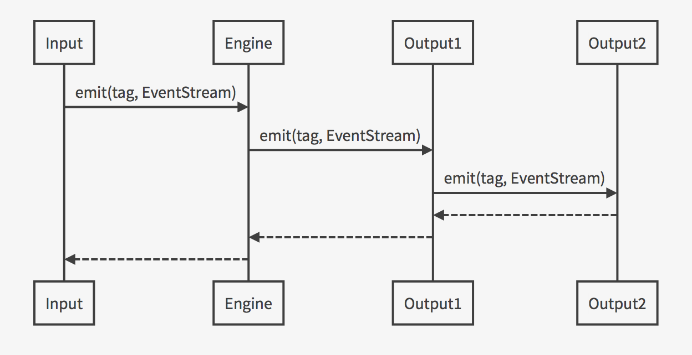
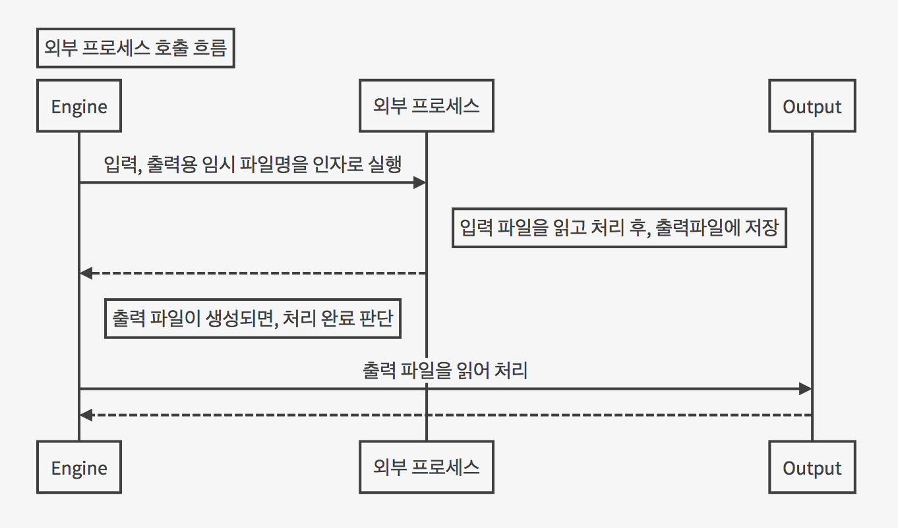

# Swak 개발자 문서

이 페이지에서는 개발자를 위한 Swak의 내부 구조 및 플러그인에 대해 설명한다.

## 플러그인

플러그인은 입력과 출력, 그리고 보통 플러그인 크게 세 가지로 나눈다. 입력 플러그인은 `in` 출력 플러그인은 `out`으로 시작하고 파이썬 클래스 이름 형식을 따른다. 보통 플러그인은 파이썬 함수 이름 형식을 따른다.

### 입/출력 플러그인 처리 흐름

입력 플러그인은 데이터의 스트림을 얻어내는 데 사용되고, 출력 플러그인은 그 스트림을 가공하거나, 최종적으로 전송하는데 사용된다. 

입력은 한 번만 나오고, 출력은 한 번 이상 연쇄될 수 있다.



## 외부 프로세스 호출

### 외부 프로세스 호출 흐름
외부 실행파일이나 스크립트를 실행할 수 있다. 단, 그것들은 입력 파일명과 출력 파일명을 인자로 받아 실행하도록 구성되어야 한다.



## 폴더 구조
    
    swak/
        bin/  # 실행 파일들
        swak/  # 코드
            plugins/  # 표준 플러그인들


# Swak 플러그인 만들기
여기에서는 플러그인 만드는 법을 살펴보겠다. Swak 플러그인은 플러그인 디렉토리(`swak/swak/plugins`)에 위치하며, Swak이 기동할 때 자동으로 로딩된다. 기본 플러그인은 플러그인 디렉토리에 Swak과 함께 배포된다. 외부 플러그인은 누구나 만들어서 플러그인 디렉토리에 추가하면 된다.

## 외부 플러그인 규칙

여기서 Swak의 플러그인 코드는 GitHub을 통해서 관리되는 것으로 가정하며, 다음과 같은 규칙을 따라야 한다.

- GitHub의 저장소(Repository) 이름은 `swak-plugin-` 으로 시작한다.
- 정해진 규칙에 맞게 문서화 되어야 한다.
- 버전 정보를 갖는다.
- 플러그인이 의존하는 패키지가 있는 경우 `requirements.txt` 파일을 만들고 명시한다. (의존 패키지가 없다면 만들지 않는다.)

### 문서화 규칙

각 플러그인은 `README.md` 파일에 문서화를 해야한다. GitHub의 [Markdown 형식](https://guides.github.com/features/mastering-markdown/)에 맞게 다음과 같이 작성한다.

- 처음에 H1(`#`)으로 `swak-plugin-NAME` 형식으로 플러그인의 이름 헤더가 온다.
- 그 아래 플러그인에 대한 간단한 설명을 한다.
- 그 아래 H2(`##`)로 `설정 예시` 헤더가 온다.
- 그 아래 설정 파일의 간단한 예를 보여준다.
- 그 아래 H2(`##`)로 `동작 방식` 헤더가 온다.
- 그 아래 플러그인의 내부 동작에 관한 설명을 한다.
- 그 아래 H2(`##`)로 `인자들` 헤더가 온다.
- 그 아래 H3(`###`)로 설정 파일의 인자에 대해 각각 설명한다.

즉, 아래와 같은 구조를 같는다.

```markdown
# swak-plugin-NAME

## 설정 예시

## 동작 방식

## 인자들
```

### 버전 규칙

[유의적 버전 문서](http://semver.org/lang/ko/)를 참고하여 플러그인 버전을 명시한다.

## 샘플 플러그인
각 행마다 행번호를 붙여주는 간단한 출력용 플러그인 `linenumber`을 예제로 알아보자.

1. 먼저 GitHub에서 `swak-plugin-linenumber`라는 빈 저장소를 만든다. (이때 원하는 라이센스를 선택하고 README.md 생성을 체크한다.)
2. Swak의 `plugins` 폴더로 이동한다.
3. 저장소를 `clone`한다.

    `git clone https://github.com/GitHub계정/swak-plugin-linenumber.git linenumber`

4. `main.py` 파일을 만들고 플러그인 코드를 작성한다.
5. 테스트용 설정 파일 `cfg-test.yml`을 작성한다.
5. Swak의 기본 폴더로 돌아와 `python swak.runner swak/plugins/linenumber/cfg-test.yml`로 실행해본다.

## 개발용 실행

